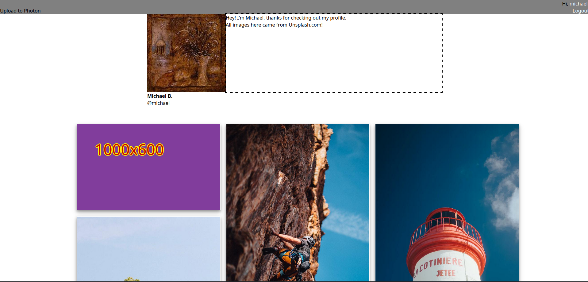

Photon is an instagram clone.

See init.sql for the database schema and .env_example for the configuration file.
Most dependencies will work out of the box using go get, but https://github.com/kolesa-team/goexiv requires special installation of a dependency called libexiv2. See the github page for more details.
Designed for use with bunny.net CDN

AI Disclosure:
Cursor was used to generate some CSS/HTML styling and structuring. All logic/imperative/functional code and Go files written by me and me alone..

Special Thanks:
Font: Liberation Sans Bold
    https://github.com/liberationfonts/liberation-fonts
Image Grid Masonry Library: Macy.js
    https://github.com/bigbite/macy.js
